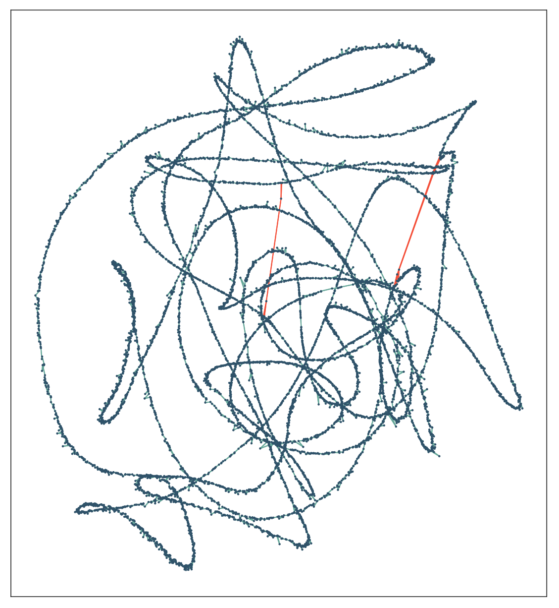

# Rala

[](https://travis-ci.org/rvaser/rala)

Layout module for raw de novo DNA assembly of long uncorrected reads.

## Description
Rala is intended as a standalone layout module to assemble raw reads generated by third generation sequencing. It trims sequence adapters, purges chimeric sequences and removes repeat-induced overlaps by examining sequence pile-o-gram. Afterwards, an assembly graph is built and simplified in the default way, i.e. applied are transitive reduction, tipping and bubble popping. Leftover tangles are resolved by laying out the graph in a 2D plane with the help of the force directed placement algorithm, and long edges are removed (see figures bellow).

Rala takes as input two files: sequences in FASTA/FASTQ format and overlaps between them in PAF/MHAP format. Both input files can be compressed with gzip. Output is a set of contigs in FASTA format.

For maximal performance, Rala should be run twice with minimap (or minimap2) to improve repeat annotation due to k-mer filtering. A sample run can be seen bellow (and found in `misc/raven.sh` alongside minimap2 version):

```bash
minimap -t <threads> -L100 -Sw5 -m0 <sequences> <sequences> > overlaps.paf

rala -t <threads> -p <sequences> overlaps.paf > uncontained.fasta

minimap -t <threads> -L100 -w5 -m0 -f0.00001 uncontained.fasta <sequences> > uncontained.paf

rala -t <threads> -s uncontained.paf <sequences> overlaps.paf > <layout>
```

*Pile-o-gram of a chimeric read*


*Pile-o-gram of two reads which overlap on a repetitive region*


*Force directed layout of an assembly graph with highlighted false overlaps&*


## Dependencies
1. gcc 4.8+ or clang 3.4+
2. cmake 3.2+

## Installation
To install Rala run to following commands:

```bash
git clone --recursive https://github.com/rvaser/rala.git rala
cd rala
mkdir build
cd build
cmake -DCMAKE_BUILD_TYPE=Release ..
make
```

After successful installation, an executable named `rala` will appear in `build/bin`.

Optionally, you can run `sudo make install` to install rala executable to your machine.

***Note***: if you omitted `--recursive` from `git clone`, run `git submodule update --init --recursive` before proceeding with compilation.

## Usage

Usage of rala is as following:

    rala [options ...] <sequences> <overlaps>

        <sequences>
            input file in FASTA/FASTQ format (can be compressed with gzip)
            containing sequences
        <overlaps>
            input file in MHAP/PAF format (can be compressed with gzip)
            containing pairwise overlaps

        options:
            -p, --preconstruct
                print uncontained sequences for second iteration
            -s, --sensitive-overlaps <file>
                input file in MHAP/PAF format (can be compress with gzip)
                containing more sensitive overlaps
            -u, --include-unassembled
                output unassembled sequences (singletons and short contigs)
            -d, --debug <string>
                enable debug output with given prefix
            -t, --threads <int>
                default: 1
                number of threads
            --version
                prints the version number
            -h, --help
                prints the usage

## Contact information

For additional information, help and bug reports please send an email to: robert.vaser@fer.hr.

## Acknowledgement

This work has been supported in part by Croatian Science Foundation under the project UIP-11-2013-7353.
