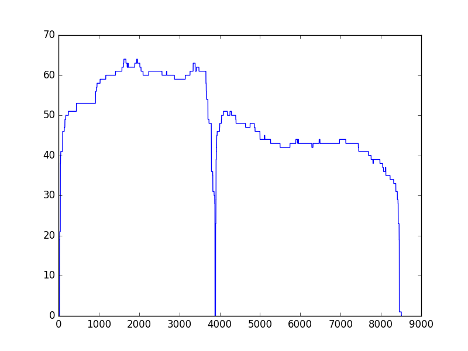
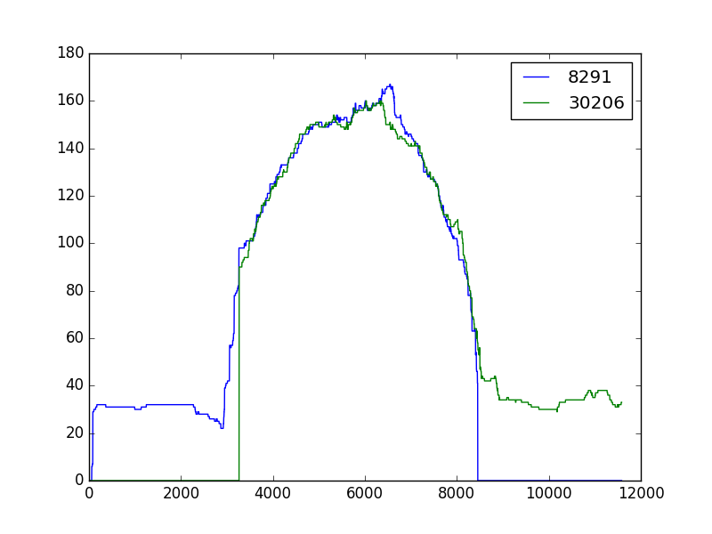

# Rala

[](https://travis-ci.org/rvaser/rala)

Layout module for raw de novo DNA assembly of long uncorrected reads.

## Description
Rala is intended as a standalone layout module to assemble raw reads generated by third generation sequencing. It was inspired by ideas used in [HINGE](https://github.com/HingeAssembler/HINGE) for preprocessing and in [Miniasm](https://github.com/lh3/miniasm) for assembly graph simplification. With the help of coverage graphs, chimeric reads are detected and cut while overlaps between unbridged repeat reads are removed from the dataset (see figures bellow). After preprocessing is done, an assembly graph is built and simplified with transitive reduction, trimming, bubble popping and, as a last resort, heuristics which untangle leftover junctions in graph.

Rala takes as input two files: raw reads in FASTQ format and overlaps between them produced by [Minimap](https://github.com/lh3/minimap) in PAF or MHAP format. If using PAF, reads should be preprocessed with *'misc/fastq_formatter.py'* which replaces read names with identifiers, **before** running Minimap. Output is a set of contigs in FASTA format.

*Coverage graph of a chimeric read*


*Coverage graphs of repeat reads which overlap is removed*



## Dependencies
1. gcc 4.8+ or clang 3.4+
2. cmake 3.2+

## Installation
To install Rala run to following commands:

```bash
    git clone --recursive https://github.com/rvaser/rala.git rala
    cd rala
    mkdir build
    cd build
    cmake -DCMAKE_BUILD_TYPE=Release ..
    make
```

After succesfull installation, an executable named `rala` will appear in `build/bin`.

Optionally, you can run `sudo make install` to install rala executable to your machine.

***Note***: if you omitted `--recursive` from `git clone`, run `git submodule init` and `git submodule update` before proceeding with compilation.

## Usage

Usage of rala is as following:

    rala [options ...] <reads> <overlaps>
        <reads>
            input file in FASTA/FASTQ format containing reads
        <overlaps>
            input file in MHAP/PAF format containing pairwise overlaps
            !note: if you are using an overlapper with the PAF file format,
                reformat the read set with misc/fasta_formatter.py (or
                misc/fastq_formatter.py) before running the overlapper

        options:
            -t, --threads <int>
                default: hardware concurrency / 2
                number of threads
            -h, --help
                prints out the help

## Contact information

For additional information, help and bug reports please send an email to: robert.vaser@fer.hr.

## Acknowledgement

This work has been supported in part by Croatian Science Foundation under the project UIP-11-2013-7353.
